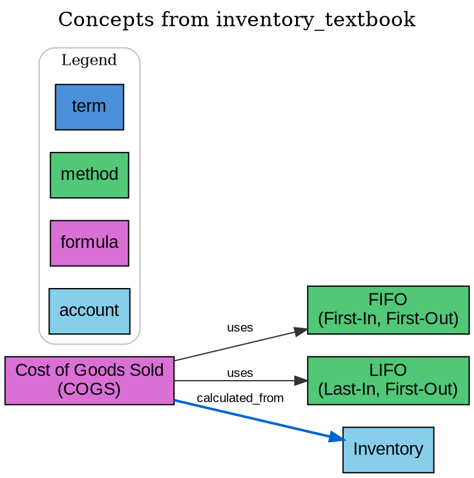

# Phase 6D: Concept Extraction - Graph Visualization

## Overview

Add graph visualization capabilities for concept relationships, enabling users to export concept graphs as DOT or PNG format.

## Prerequisites

- Phase 6A complete (core infrastructure)
- Phase 6B complete (CLI integration)
- Phase 6C complete (MCP tools)

## Dependencies

**pyproject.toml additions:**

```toml
[project.optional-dependencies]
concepts = [
    "instructor>=1.0.0",
    "graphviz>=0.20",           # Graph visualization
]
```

**System requirement:**
- Graphviz must be installed on the system for PNG rendering
- macOS: `brew install graphviz`
- Ubuntu: `apt install graphviz`
- Windows: Download from graphviz.org

---

## Implementation Details

### 1. Graph Visualization Module (`src/cli/graph_viz.py`)

```python
"""Graph visualization for concept relationships."""

import json
from pathlib import Path
from typing import Optional

# Type alias for when graphviz is not installed
Digraph = None


def _get_graphviz():
    """Lazy import graphviz."""
    try:
        from graphviz import Digraph
        return Digraph
    except ImportError:
        return None


# Concept type to color mapping
CONCEPT_COLORS = {
    "term": "#4A90D9",       # Blue
    "method": "#50C878",     # Green
    "principle": "#FFB347",  # Orange
    "formula": "#DA70D6",    # Orchid
    "account": "#87CEEB",    # Sky blue
}

# Relationship type to style mapping
RELATION_STYLES = {
    "uses": {"style": "solid", "color": "#333333"},
    "requires": {"style": "dashed", "color": "#666666"},
    "calculated_from": {"style": "bold", "color": "#0066CC"},
    "component_of": {"style": "dotted", "color": "#009900"},
    "recorded_in": {"style": "solid", "color": "#990099"},
    "supersedes": {"style": "dashed", "color": "#CC0000"},
}


def concepts_to_dot(
    concepts: list[dict],
    relations: list[tuple[str, str, str]],  # (from_name, to_name, relation_type)
    title: str = "Concept Graph",
) -> str:
    """
    Generate DOT format string from concepts and relations.

    Args:
        concepts: List of concept dicts with name, concept_type
        relations: List of (from_concept, to_concept, relation_type) tuples
        title: Graph title

    Returns:
        DOT format string
    """
    lines = [
        "digraph ConceptGraph {",
        f'    label="{title}";',
        "    labelloc=t;",
        "    fontsize=16;",
        "    rankdir=LR;",
        "    node [shape=box, style=filled, fontname=Arial];",
        "    edge [fontname=Arial, fontsize=10];",
        "",
    ]

    # Add nodes
    for concept in concepts:
        name = concept.get("name", "")
        concept_type = concept.get("concept_type", "term")
        color = CONCEPT_COLORS.get(concept_type, "#CCCCCC")
        aliases = json.loads(concept.get("aliases", "[]"))

        # Create label with aliases
        label = name
        if aliases:
            label += f"\\n({', '.join(aliases[:2])})"

        # Escape quotes in label
        label = label.replace('"', '\\"')
        node_id = _sanitize_id(name)

        lines.append(f'    "{node_id}" [label="{label}", fillcolor="{color}"];')

    lines.append("")

    # Add edges
    for from_name, to_name, relation_type in relations:
        from_id = _sanitize_id(from_name)
        to_id = _sanitize_id(to_name)
        style = RELATION_STYLES.get(relation_type, {"style": "solid", "color": "#333333"})

        lines.append(
            f'    "{from_id}" -> "{to_id}" '
            f'[label="{relation_type}", style={style["style"]}, color="{style["color"]}"];'
        )

    lines.append("")

    # Add legend
    lines.extend([
        "    subgraph cluster_legend {",
        '        label="Legend";',
        "        fontsize=12;",
        "        style=rounded;",
        "        color=gray;",
    ])

    for concept_type, color in CONCEPT_COLORS.items():
        lines.append(
            f'        legend_{concept_type} [label="{concept_type}", fillcolor="{color}", shape=box];'
        )

    lines.append("    }")
    lines.append("}")

    return "\n".join(lines)


def _sanitize_id(name: str) -> str:
    """Convert concept name to valid DOT node ID."""
    import re
    # Replace spaces and special chars with underscores
    sanitized = re.sub(r'[^\w]', '_', name)
    return sanitized.lower()


def render_graph(
    dot_content: str,
    output_path: Path,
    format: str = "png",
) -> Path:
    """
    Render DOT content to image file.

    Args:
        dot_content: DOT format string
        output_path: Output file path (without extension)
        format: Output format (png, svg, pdf)

    Returns:
        Path to rendered file

    Raises:
        ImportError: If graphviz not installed
        RuntimeError: If rendering fails
    """
    Digraph = _get_graphviz()
    if Digraph is None:
        raise ImportError(
            "graphviz package not installed. "
            "Install with: pip install 'kidkazz[concepts]'"
        )

    try:
        from graphviz import Source

        source = Source(dot_content)
        output_file = source.render(
            filename=str(output_path),
            format=format,
            cleanup=True,  # Remove intermediate DOT file
        )
        return Path(output_file)

    except Exception as e:
        raise RuntimeError(f"Graph rendering failed: {e}")


def generate_concept_graph(
    store,
    doc_id: Optional[str] = None,
    output_path: Optional[Path] = None,
    format: str = "png",
    title: Optional[str] = None,
) -> tuple[str, Optional[Path]]:
    """
    Generate concept graph from stored concepts.

    Args:
        store: HelixChunkStore instance
        doc_id: Filter to concepts from specific document
        output_path: Path to save rendered image (optional)
        format: Output format (dot, png, svg, pdf)
        title: Graph title

    Returns:
        Tuple of (DOT content, rendered file path or None)
    """
    # Get concepts
    concepts = store.list_concepts(doc_id=doc_id)

    if not concepts:
        return "digraph Empty { label=\"No concepts found\"; }", None

    # Get relations by traversing each concept
    relations = []
    seen_relations = set()

    for concept in concepts:
        concept_id = concept.get("concept_id")
        related = store.get_related_concepts(concept_id)

        for rel_concept in related:
            from_name = concept.get("name")
            to_name = rel_concept.get("name")
            # Default relation type (could be enhanced to store actual type)
            relation_type = "relates_to"

            relation_key = (from_name, to_name)
            if relation_key not in seen_relations:
                seen_relations.add(relation_key)
                relations.append((from_name, to_name, relation_type))

    # Generate title
    if not title:
        if doc_id:
            title = f"Concepts from {doc_id}"
        else:
            title = "Knowledge Graph"

    # Generate DOT
    dot_content = concepts_to_dot(concepts, relations, title)

    # Render if output path specified and format is not DOT
    rendered_path = None
    if output_path:
        if format == "dot":
            # Just write DOT content
            output_path.write_text(dot_content)
            rendered_path = output_path
        else:
            rendered_path = render_graph(dot_content, output_path.with_suffix(""), format)

    return dot_content, rendered_path
```

### 2. CLI Graph Command (`src/cli/commands/concepts.py`)

Add to existing concepts.py:

```python
@app.command("graph")
def graph_concepts(
    doc_id: Optional[str] = typer.Argument(None, help="Document ID (all if not specified)"),
    output: Optional[Path] = typer.Option(None, "--output", "-o", help="Output file path"),
    format: str = typer.Option("png", "--format", "-f", help="Output format: dot, png, svg, pdf"),
    title: Optional[str] = typer.Option(None, "--title", "-t", help="Graph title"),
    view: bool = typer.Option(False, "--view", "-v", help="Open rendered graph"),
) -> None:
    """
    Generate a visualization of concept relationships.

    Examples:
        kidkazz concepts graph                      # All concepts, PNG to stdout
        kidkazz concepts graph inventory            # Concepts from inventory doc
        kidkazz concepts graph -o graph.png         # Save to file
        kidkazz concepts graph -f dot -o graph.dot  # Export as DOT
        kidkazz concepts graph --view               # Render and open
    """
    config = CLIConfig.load()
    store = get_store(config)

    try:
        from ..graph_viz import generate_concept_graph

        # Generate graph
        dot_content, rendered_path = generate_concept_graph(
            store=store,
            doc_id=doc_id,
            output_path=output,
            format=format,
            title=title,
        )

        if output:
            if rendered_path:
                print_success(f"Graph saved to: {rendered_path}")

                # Open if requested
                if view:
                    import subprocess
                    import platform

                    if platform.system() == "Darwin":
                        subprocess.run(["open", str(rendered_path)])
                    elif platform.system() == "Linux":
                        subprocess.run(["xdg-open", str(rendered_path)])
                    elif platform.system() == "Windows":
                        subprocess.run(["start", str(rendered_path)], shell=True)
            else:
                print_error("Failed to render graph")
                raise typer.Exit(1)
        else:
            # Print DOT to stdout if no output specified
            console.print(dot_content)

    except ImportError as e:
        print_error(str(e))
        print_warning("For PNG/SVG output, install graphviz:")
        print_warning("  pip install 'kidkazz[concepts]'")
        print_warning("  # Also install system graphviz:")
        print_warning("  # macOS: brew install graphviz")
        print_warning("  # Ubuntu: apt install graphviz")
        raise typer.Exit(1)

    except Exception as e:
        print_error(f"Failed to generate graph: {e}")
        raise typer.Exit(1)


@app.command("export")
def export_concepts(
    doc_id: Optional[str] = typer.Option(None, "--doc-id", "-d", help="Filter by document"),
    output: Path = typer.Option(..., "--output", "-o", help="Output file path"),
    format: str = typer.Option("json", "--format", "-f", help="Export format: json, csv"),
) -> None:
    """
    Export concepts to file.

    Examples:
        kidkazz concepts export -o concepts.json
        kidkazz concepts export -o concepts.csv -f csv
        kidkazz concepts export -d inventory -o inv_concepts.json
    """
    config = CLIConfig.load()
    store = get_store(config)

    try:
        concepts = store.list_concepts(doc_id=doc_id)

        if not concepts:
            print_warning("No concepts to export")
            return

        if format == "json":
            import json
            output.write_text(json.dumps(concepts, indent=2))

        elif format == "csv":
            import csv

            with output.open("w", newline="") as f:
                writer = csv.writer(f)
                writer.writerow(["concept_id", "name", "type", "definition", "aliases"])

                for c in concepts:
                    aliases = json.loads(c.get("aliases", "[]"))
                    writer.writerow([
                        c.get("concept_id", ""),
                        c.get("name", ""),
                        c.get("concept_type", ""),
                        c.get("definition", ""),
                        "; ".join(aliases),
                    ])

        else:
            print_error(f"Unknown format: {format}")
            raise typer.Exit(1)

        print_success(f"Exported {len(concepts)} concepts to: {output}")

    except Exception as e:
        print_error(f"Export failed: {e}")
        raise typer.Exit(1)
```

### 3. MCP Graph Tool (`src/mcp_server/tools.py`)

Add to concept tools section:

```python
@mcp.tool()
def get_concept_graph_dot(
    doc_id: Optional[str] = None,
) -> str:
    """
    Get concept graph in DOT format for visualization.

    The DOT format can be rendered using Graphviz or online tools
    like https://dreampuf.github.io/GraphvizOnline/

    Args:
        doc_id: Filter to concepts from a specific document (optional)

    Returns:
        DOT format string representing the concept graph.
    """
    from src.cli.graph_viz import concepts_to_dot

    logger.info(f"get_concept_graph_dot: doc_id={doc_id}")

    concepts = state.store.list_concepts(doc_id=doc_id)

    if not concepts:
        return 'digraph Empty { label="No concepts found"; }'

    # Get relations
    relations = []
    seen = set()

    for concept in concepts:
        concept_id = concept.get("concept_id")
        related = state.store.get_related_concepts(concept_id)

        for rel_concept in related:
            from_name = concept.get("name")
            to_name = rel_concept.get("name")
            key = (from_name, to_name)
            if key not in seen:
                seen.add(key)
                relations.append((from_name, to_name, "relates_to"))

    title = f"Concepts from {doc_id}" if doc_id else "Knowledge Graph"
    return concepts_to_dot(concepts, relations, title)
```

---

## Test Plan

### test_graph_viz.py (~15 tests)

- `_sanitize_id` handles special characters
- `concepts_to_dot` generates valid DOT
- `concepts_to_dot` with empty concepts
- `concepts_to_dot` with no relations
- `concepts_to_dot` includes legend
- `CONCEPT_COLORS` has all types
- `RELATION_STYLES` has common types
- `render_graph` with graphviz installed
- `render_graph` without graphviz (ImportError)
- `generate_concept_graph` full pipeline

### test_concepts_graph_cli.py (~8 tests)

- `graph` command outputs DOT to stdout
- `graph` command with --output
- `graph` command with --format png
- `graph` command with --format dot
- `graph` command with doc_id filter
- `export` command to JSON
- `export` command to CSV

---

## Verification

1. **Generate DOT output:**
   ```bash
   kidkazz concepts graph > graph.dot
   cat graph.dot
   ```

2. **Generate PNG:**
   ```bash
   kidkazz concepts graph -o concepts.png
   open concepts.png  # macOS
   ```

3. **Filter by document:**
   ```bash
   kidkazz concepts graph inventory_textbook -o inventory_graph.png
   ```

4. **Export concepts:**
   ```bash
   kidkazz concepts export -o concepts.json
   kidkazz concepts export -o concepts.csv -f csv
   ```

5. **Run tests:**
   ```bash
   PYTHONPATH=. pytest tests/test_graph_viz.py -v
   PYTHONPATH=. pytest tests/test_concepts_graph_cli.py -v
   ```

---

## Files Changed/Created

### New Files
- `src/cli/graph_viz.py`
- `tests/test_graph_viz.py`
- `tests/test_concepts_graph_cli.py`

### Modified Files
- `pyproject.toml` (add graphviz dependency)
- `src/cli/commands/concepts.py` (add graph, export commands)
- `src/mcp_server/tools.py` (add get_concept_graph_dot)
- `src/mcp_server/resources.py` (document graph tool)

---

## Example Output

### DOT Format



### Rendered PNG

The graph shows:
- Colored nodes by concept type
- Directed edges with relationship labels
- Legend explaining colors
- Aliases shown under concept names

---

## Summary

Phase 6D completes the concept extraction feature by adding visualization capabilities:

1. **DOT generation** - Pure Python, no dependencies
2. **PNG/SVG rendering** - Requires graphviz package
3. **CLI commands** - `graph` and `export`
4. **MCP tool** - `get_concept_graph_dot` for Claude Code

After Phase 6D, the complete concept extraction feature is ready for use.
